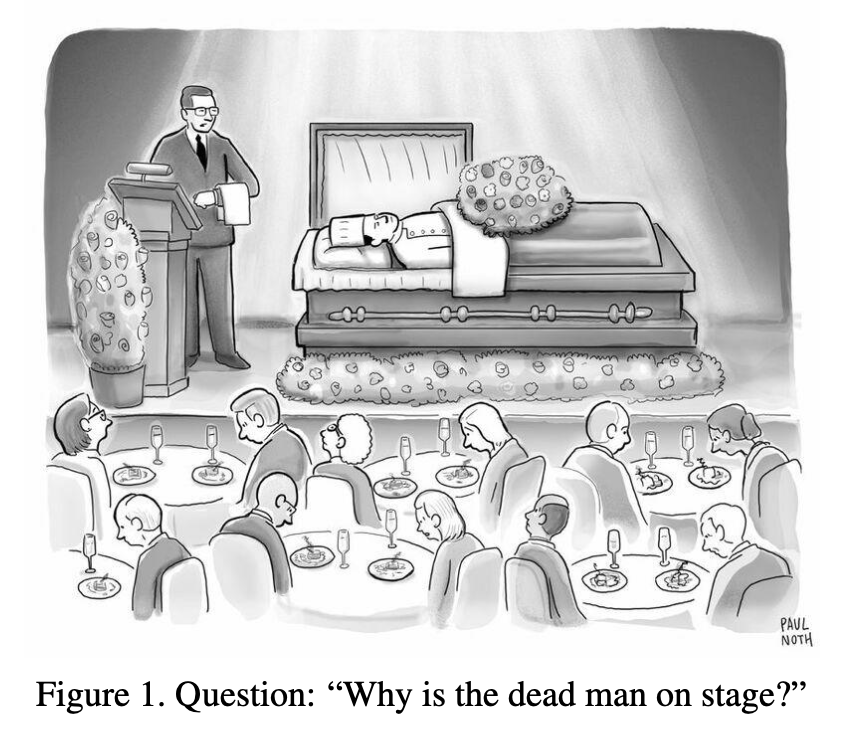
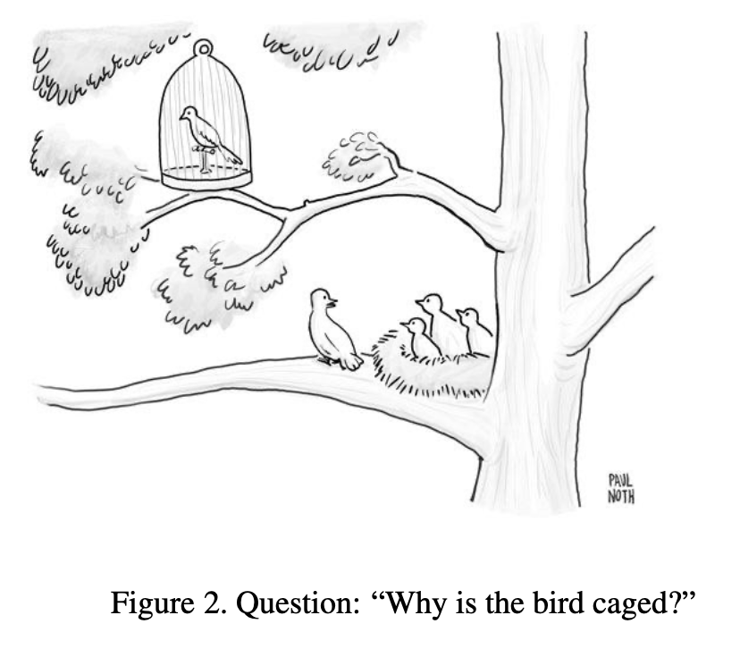

# NY Times Cartoon Captioning
The New York Times has hosted a series of cartoon captioning [contests](https://www.newyorker.com/cartoons/contest), which invites participants to submit their funniest caption.
As part of their ongoing research [jmhessel](https://huggingface.co/datasets/jmhessel/newyorker_caption_contest) has facilitated a set of annotations and humor benchmarks to be
used on the exploration of machine learning humor comprehension.

# BLIP
This multi-modal image captioning model introduced a novel q-former layer, which allows images features and text embeddings from a range of frozen vision encoders and LLMs
to be fine tuned on annotated image datasets.

# Cartoon Captioning
In this project, we developed a codebase which facilitates experimentation on the process of fine-tuning a BLIP model on the NYTimes Cartoon Captioning dataset. Our baseline model
used the Opt 2.7B LLM.

  
